# ACE Engineering : Automation Control Electrical

*Professional engineering services for all your industrial requirements.


## Contents

---

* UX
  * Project Goals
    * User Goals
    * User Stories
    * Site Owner Goals
    * User Requirements and Expectations
    * Design Choices
      * Fonts
        * Icons
        * Colours
* Technologies
* Features
  * Features that have been developed
    * Features that will be implemented in the future
* Testing
* Bugs
* Deployment
* Credit

## UX (User Experience)

---

### Project Goals

* The goal of this project is to create a digital launchpad for a small electrical engineering company. The main services on offer need to be clearly demonstrated on the home page through simple bullet-points. Links to section pages provide further information on each of these services. A simple contact page allows users to send a business request.

### User Goals

* Find information about **electrical design services**.
* Find information about **motor and drive services**.
* Find information about **automation services**.
* Find information about **machine safety services**.
* **Send an email** to the site owner.

### User Stories

* As a **user**, I want to see all the main services this company can offer at a glance so that in a single scroll of the homepage, I know exactly what this company has to offer.
* As a **user**, I want **fast loading-times** for pages.
* As a **user**, I want a **simple and well laid-out** website that gives the impression of these complex topics being made simple.
* As a **user**, I want to see **modern design** to show that the site owner is au fait with the latest developments in technology.
* As a **user**, I want to see some **examples of previous projects** done by this company.
* As a **user**, I want to see references to **industry standards** to be sure the deliverables will meet my company's specifications.
* As a **user**, I want to be able to **contact** the site owner and give a simple description of a potential project.

### Site Owner Goals

* As a **site-owner**, I want to clearly **communicate my company's services**.
* As a **site-owner**, I want to convey **technical expertise in the subject matter** to site visitors.
* As a **site-owner**, I want contact **telephone and email readily available** because building connections is the key to business.
* As a **site-owner**, I want **no social media affiliations** on this site becuase some projects will be undertaken with stict NDA and security requirements.
* As a **site-owner**, I want a **simple and concise contact form** that gathers important project data from potential customers.

### User Requirements and Expectations

#### Requirements

* Easily navigate with a **navbar**.
* Provide a simple overview on the main page and a little more detail in sub pages.
* Fast **loading-times**.
* **Contact form** for users to send a project information request.
* Company **contact** details readily accessible on the **header and footer** of every page.

#### Expectations

* Content is **visually satisfying** and **informative**.
* **Navigation** takes **user** to specific **parts** of the **website**.
* Working **Read More** buttons to **avoid** big **lumps** of clustered **text**.

### Design Choices

---
In designing this site I took inspiration from a few engineering websites but most significantly, [Harp Engineering](http://www.harpelectricaleng.com/) .
Engineering is a very broad discipline and companies are generally highly-specialised in the services they provide.
Hence, the most difficult task for any potential visitor to an engineering site is to find out what exact services
a particular company provides. Generally a visitor to a site will make a decision in less than 10 seconds
whether a particular company can provide what they are looking for. Hence, there is urgency to convey:

* We operate in the **Industrial Sector**.
* We are primarily **Electrical and Automation Engineers**.
* We are a **hands-on** technical company **not purely consultants**.

As a first iteration, the choice was made to design a multipage site with overview information on the main page
underneath a captivating hero image. A simple white pre-header would contain the basic contact information above
a Navbar. The four main services of the company would be clearly displayed under the hero image of an industrial
site. Links in the Navbar as well as the individual section overiews, would allow a visitor to jump off to their
desired services. A separate page would provide a contact form to allow a user to submit details of their company,
 contact details and a short description of a potential project or query.
 As the build progressed, the benefits of a single-page-scrolling site became clear in terms of design efficiency,
 loading times, ease of use and maintainability. The individual section pages were incorporated into the main page
 initially but as the build progressed further, the contact form was moved in also.
 The font Padauk was replaced with Roboto at a late stage in the project due to readability issues but Padauk was
 later re-introduced for special texts for pre-headers and footers.

#### Fonts

[Google fonts](https://fonts.google.com/) have been used to give typographic style.
font-family: **Roboto** is used for most text on the site.
font-family: **Padauk** is used for special sans-serif fonts such as the pre-header and footer where a more compact and stylish font are desired.

#### Icons

[FontAwesome](https://fontawesome.com/) free icons have been used throughout this project.

#### Colors

The website colors were chosen using [coolors.co](https://coolors.co/). The choice was based on a providing a sense of calm reliable colours. Rich darks for backgrounds and menus. Blues for other elements and headings.


## Wireframing

Wireframing was done using Balsamiq under full-functional trial provided by Code Institute.
Wireframes were developed for a [main page](wireframes/wf-home-page-rev-0-1.png), [standard section page](wireframes/wf-electrical-design-page-0-1.png) and a [contact page](wireframes/wf-contact-page-rev0-1.png).
As the design progressed however, the site diverged significantly from multipage model to a single scolling site with all content on a single page.

---

## Features

---
**Features** that have been **implemented:**

* Simple navigation on all screen sizes.
* Contact form with text entry, drop-downs and check boxes.
* Pre-header and footer with contact information readily at hand to a person opening the first page.
* Simple but attractive design, imagery and jumbotrons.
* Sticky header with collapse on smaller screen sizes to burger navigation icon and auto-closing on clicking a link.
* Floating return to top button.

**Features** that will be **implemented** in the **future:**

* The **sticky-top** could be enhanced by having the white pre-header disappear on scroll leaving the main nav bar on top. This feature was beyond both my abilities and time allowance during the project but would be a nice addition.
* The styling on some of the section photos could definitely be improved with media queries to change the heights and widths according to screen width. Possibly using flexbox rather than bootstrap grid could have made the difference here. Again, it was beyond the time frame to achieve this.
* Some additional styling around the typefaces and font choices could improve the look of the section text. Possibly, a lightly serifed font would look better than the Roboto in place at the moment.
* Adding carosels for project images or popouts would also be a notable enhancement.
* Speed optimisation is an area that should be addressed with an effort to optimise image and font loading.
* Limiting the width of the main content to about 2000px and greying out a background at screen widths beyond this would definitely help visually on bigger monitor sizes.
* Further work is required on the animation effect of the main hero image to make it work more reliably. At the moment, the ease in effect does not happen every time.

## Technologies Used

---

### Languages

* HTML
* CSS
* JavaScript

### Tools & Libraries

* [Git](https://git-scm.com/)
* [Bootstrap](https://getbootstrap.com/)
* [Font-Awesome](https://fontawesome.com/icons?d=gallery)
* [Popper](https://popper.js.org/)
* [JQuery](https://jquery.com/)
* [Google fonts](https://fonts.google.com/)
* [Markdownlint](https://dlaa.me/markdownlint/)

## Testing

---

### HTML Test

HTML code has been tested using the [HTML Validator](https://validator.w3.org/) and gave the following errors:

#### HTML Test Errors

* From line 373, column 25; to line 373, column 85

``` html
    <select class="form-control" id="salutation" placeholder="G">
```

* From line 385, column 25; to line 385, column 47

``` html
    <label for="givenName">Given
```

#### HTML Test Fixes

* Erroneous placeholder reference deleted from the form dropdown list.
* Misspelling between the label and the id fixed for the form's given name entry.
* Re-Testing after these corrections gave a **PASS**.

### CSS Test

CSS code has been tested using the [CSS validator](http://jigsaw.w3.org/css-validator/) and gave the following errors and warnings.

#### CSS Test Errors

 176 #btn-floating-home Value Error : background-color 212121 is not a background-color value : 212121

#### CSS Test Warnings

``` css
    153  -moz-transition /*is an unknown vendor extension*/
    154  -webkit-transition /*is an unknown vendor extension*/
    190  -webkit-box-shadow /*is an unknown vendor extension*/
    191  -moz-box-shadow /*is an unknown vendor extension*/
    293 .footer-list-group-item /*Same color for background-color and border-color*/
```

#### CSS Test Fixes

* Removed redundant id #btn-floating-home from code.
* Set border: none; in .footer-list-group-item class.
* Errors for "-moz-transition", "-webkit-transition", "-webkit-box-shadow" and "-moz-box-shadow" are ignored.
* Re-testing after these fixes gave a **PASS**.

### Responsiveness

* The site has been implemented using Bootstrap throughout and built with a mobile first philosophy.
* Responsiveness is quite good going from mobile to larger screens and navbar collapses predictably.
* The back to top button suggested by my mentor makes returning to the top of the screen straight-forward and intuitive.
* Some of the propotioning on images could be improved with media queries but overall the test is a **PASS**.

<details>
  <summary>Responsiveness of the design was tested using Chrome's Developer Tools and the result overall was a **PASS**. Open the dropdown here to see screenshots of the results.</summary>

#### Summary of responsive design tests

* Full Screen 24” Browser Window – Google Chrome – No Issues - **PASS**
  * Result: 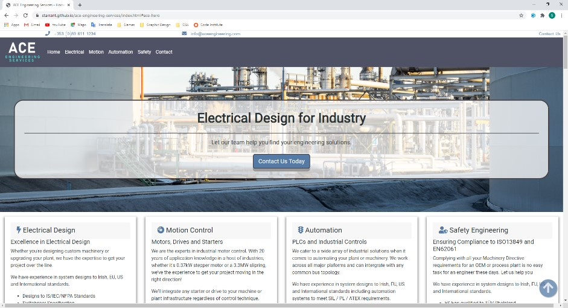
  * iPhone 6/7/8 – Slight shift in page top and bottom cut off when scrolling - **PASS**
  * Result: 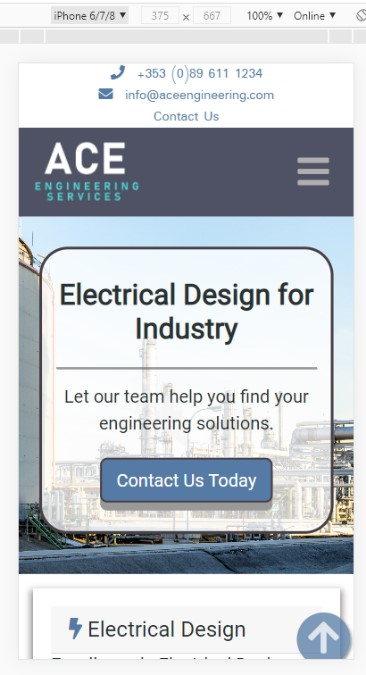
  * iPhone 6/7/8 Plus – Slight shift in page top and bottom cut off when scrolling - **PASS**
  * Result: 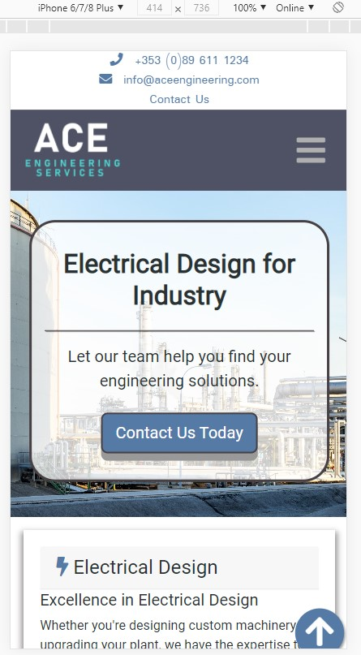
  * iPhone X – Slight shift in page top and bottom cut off when scrolling - **PASS**
  * Result: 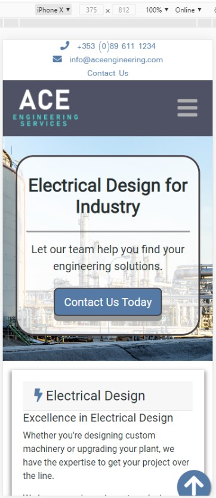
  * iPad – ~48px shift in page top and bottom cut off when scrolling - **PASS**
  * Result: 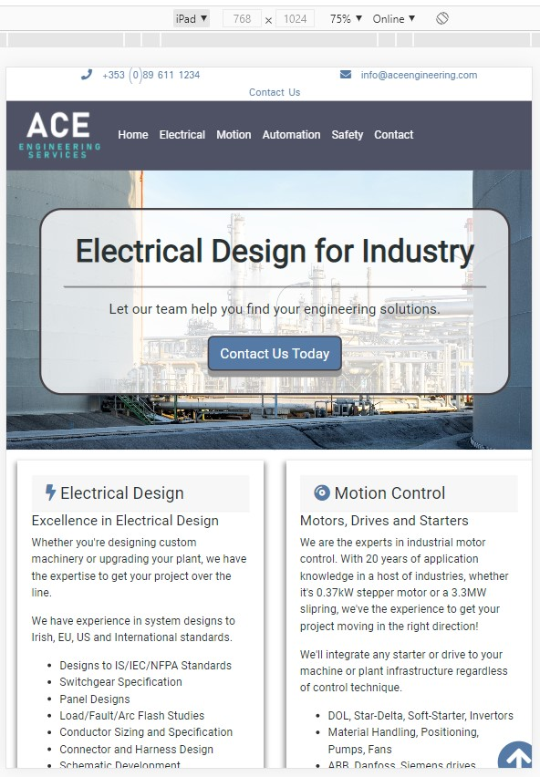
  * iPad Pro – Slight shift in page top and bottom cut off when scrolling - **PASS**
  * Result: 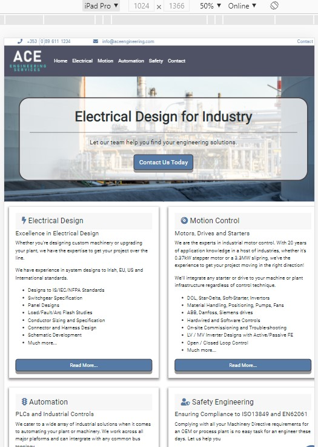
  * Surface Duo – Slight shift in page top and bottom cut off when scrolling - **PASS**
  * Result: 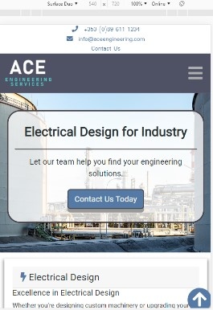
  * Galaxy Fold – Slight shift in page top and bottom cut off when scrolling - **PASS**
  * Result: 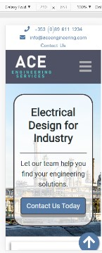

</details>

### Design

* The design of the site was inspired by the [Harp Engineering](http://www.harpelectricaleng.com/) website following their
pre-header with easily accessible contact details. Rich dark greys are paired with cool blues to give a calming color selection.
* All interactive elements have been styled using the site's colour palette or slight gradients of those colours.
* Results overall look quite good so this is a **PASS**.

### Contact form

* The contact form is based on sample code provided by Bootstrap and modified to suit the fields required.
* **Data validation** is implemented on **key fields**.
* **Submit button does not function** as is understood under the MS1 guidelines because there is no back-end code present.
* **Results**: The data validation fields have all been individually tested and **PASS**.

### User Stories

<details>
  <summary>User stories were tested using Google Chrome and developer tools. The only item of note which could be described as noteable sub-par would be the loading speed which needs improvement. Click dropdown to see individual tests.</summary>
  
#### Summary of user tests

* Test: As a **user**, I want to see all the main services this company can offer at a glance so that in a single scroll of the homepage, I know exactly what this company has to offer.
  * Result: 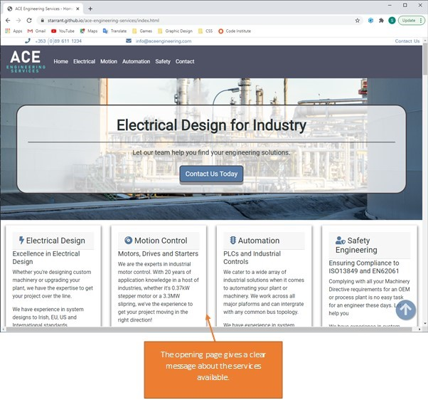
  * Test: As a **user**, I want **fast loading-times** for pages.
  * Result: 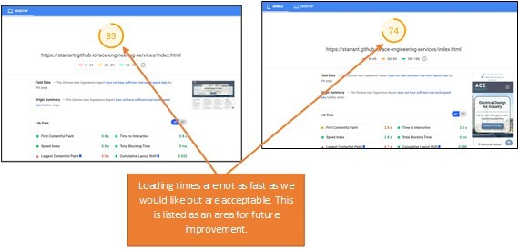
  * Test: As a **user**, I want a **simple and well laid-out** website that gives the impression of these complex topics being made simple.
  * Result: 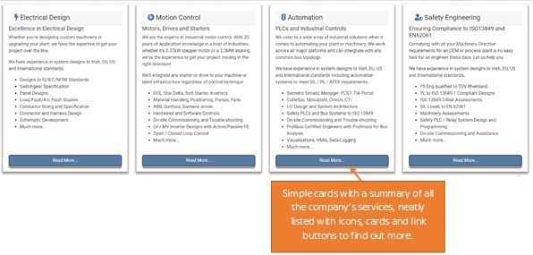
  * Test: As a **user**, I want to see **modern design** to show that the site owner is au fait with the latest developments in technology.
  * Result: 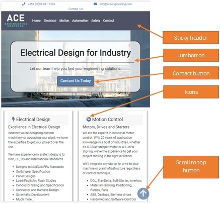
  * Test: As a **user**, I want to see some **examples of previous projects** done by this company.
  * Result: 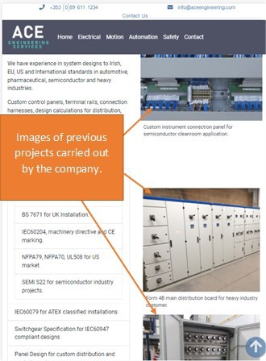
  * Test: As a **user**, I want to see references to **industry standards** to be sure the deliverables will meet my company's specifications.
  * Result: 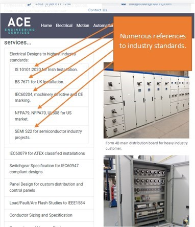
  * Test: As a **user**, I want to be able to **contact** the site owner and give a simple description of a potential project.
  * Result: 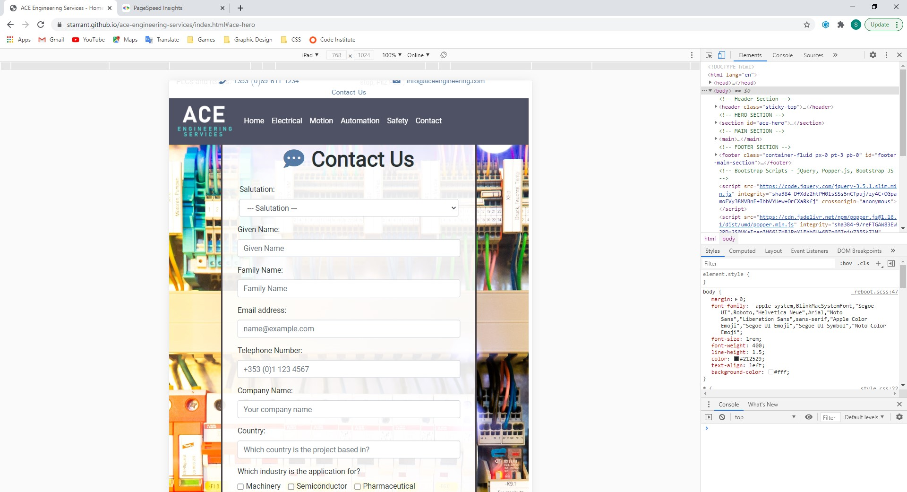

</details>

## Bugs

---

Many bugs were encountered during the development of the project - all admittedly of my own making.

### Development Bugs

* Header styling was very difficult to achieve and went through a number of iterations before getting the hang of the Bootstrap
grid. Padding, margins, centering of text and mobile first design were seemingly impossible to achieve so a version was done using
flexbox but this also had some centering issues and glitching at breakpoints. The final design was a return to the bootstrap grid
with simple bootstrap spacing classes used to minimse the y-margin on paragraphs.
* Footer styling was similarly difficult to achieve and a flexbox version of that was trialed also before reverting to bootstrap grid.
* Font Awesome icons were troublesome to get working because of an erroneous version number in the head. SVG icons were used in an
interim version of the site. My mentor spotted the error and advised to return to Font Awesome and no further issues were encountered.
* There were a lot of issues with the Navbar getting it to work correctly and collapse at the correct breakpoints.
* Page linking and images caused some difficulty until the correct reference paths were used.
* Sticky-top was a feature that cost a lot of time and effort to get functioning on the site. For most of the project, it was abandoned due to issues
regarding header margins and id links not working correctly with navigation. In the end, I got it working with a bit of advice from my mentor and a line of code
from [gomakethings.com](https://gomakethings.com/how-to-prevent-anchor-links-from-scrolling-behind-a-sticky-header-with-one-line-of-css/). Sticky-top threw up
 a number of other issues also such as the id links of anchors and the floating button which had to be resolved.
* The navbar not collapsing after click on a link was a minor issue that takes from the overall UX of the site. Unfortunately, this is not
  solveable without using a small bit of JavaScript. The source is credited below and acknowledgement is made here that I have exceeded the
  bounds of the HTML/CSS only project.

### Testing Bugs

* A few bugs were thrown up by the HTML Validator and CSS Validator. The solutions are given above in the **HTML Test** and **CSS Test** Sections.

## Deployment

---

The site has been deployed on [GitHub Pages](https://pages.github.com/) with under the following link [Ace Engineering Services](https://starrant.github.io/ace-engineering-services/index.html).

## Credits

---

* Images from [unsplash](www.unsplash.com) were used in this project. The main hero background is used courtesy of [Dimitry Anikin](@anikinearthwalker) The contact form background is used courtesy of [Marcus Spiske](@markusspiske)
* [Markdown guide basic syntax](https://www.markdownguide.org/basic-syntax/) was used as a reference in writing the README.md file.
* [Markdownlint](https://dlaa.me/markdownlint/) by [David Anson](https://github.com/DavidAnson) was used for correcting the errors in my markdown. It is an awesome resource and saved me hours of correction time.
* Code for box shadow on overview section generated by [cssgenerator.org](https://cssgenerator.org/box-shadow-css-generator.html). CSS code commented as such as per CI guidelines.
* Code for button styling has been based on modifed versions of code from [w3schools animated button pressed effect](https://www.w3schools.com/css/tryit.asp?filename=trycss_buttons_animate3).
* Code for preventing the content disappearing under the navbar when clicking on links was found on [gomakethings.com](https://gomakethings.com/how-to-prevent-anchor-links-from-scrolling-behind-a-sticky-header-with-one-line-of-css/). It was just a single line of CSS but this saved the day.
* Code for auto-collapsing the navbar when a link is clicked was found on [mdbootstrap.com](https://mdbootstrap.com/support/general/auto-close-navbar-when-click-on-link-responsive-mode/) and written by [Marta Wierzbicka](https://mdbootstrap.com/user/marta-szymanska/)
* The website [w3schools](https://www.w3schools.com/) was used heavily as a reference for HTML, CSS and Bootstrap throughout the project. As were [GetBootstrap](https://getbootstrap.com/), [StackOverflow](https://stackoverflow.com/) and [CSSTricks](https://css-tricks.com/).
* The [w3schools color mixer tool](https://www.w3schools.com/colors/colors_mixer.asp) was used to get lighter or darker variants of the site's main colors for hover effects, etc.

### Special Thanks

* My Code Institute mentor, [Simen Daehlin](https://github.com/Eventyret), for a lot of great advice and direction along the way. His time, effort and experience made a huge difference to the code quality, readability and end result. It would be hard to overstate his input here.
